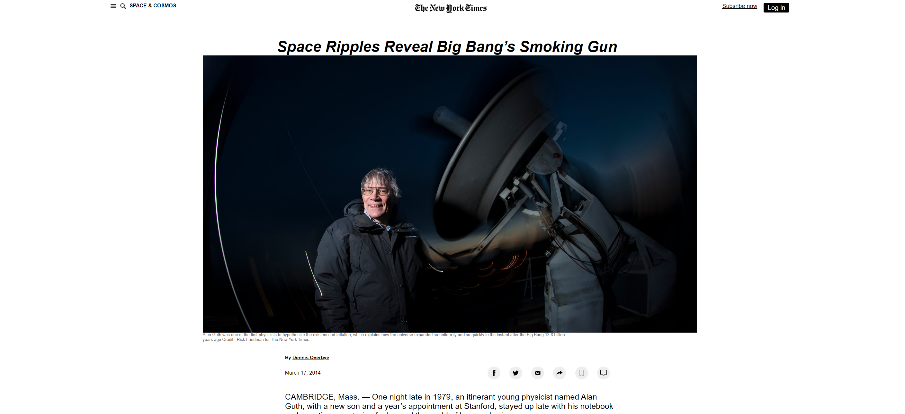

# Newyork Times Article Clone

Additional description about the project and its features.

## Built With

- HTML
- CSS

## Live Demo

[Live Demo Link](https://eager-yalow-5396ee.netlify.app)

## Getting Started

**This is an example of how you may give instructions on setting up your project locally.**
**Modify this file to match your project, remove sections that don't apply. For example: delete the testing section if the currect project doesn't require testing.**

To get a local copy up and running follow these simple example steps.

### Prerequisites

### Setup

### Install

### Usage

### Run tests

### Deployment

## Authors

👤 **Author1**

- Github: [@githubhandle](https://github.com/ershadul1)
- Twitter: [@twitterhandle](https://twitter.com/ErshadulRayhan)
- Linkedin: [linkedin](https://www.linkedin.com/in/ershadul-hakim-rayhan-a5a17649/)

👤 **Author2**

- Github: [@githubhandle](https://github.com/Haywhizzz )
- Twitter: [@twitterhandle](https://twitter.com/Haywhizzz)
- Linkedin: [linkedin](https://www.linkedin.com/in/oyeleke-ayomide-b962421a6/)

## 🤝 Contributing

Contributions, issues and feature requests are welcome!

Feel free to check the [issues page](issues/).

## Show your support

Give a ⭐️ if you like this project!

## Acknowledgments

- Hat tip to anyone whose code was used
- Inspiration
- etc

## 📝 License

This project is [MIT](lic.url) licensed.
